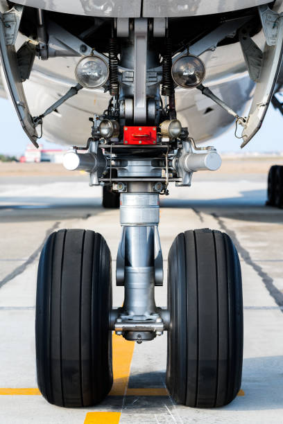
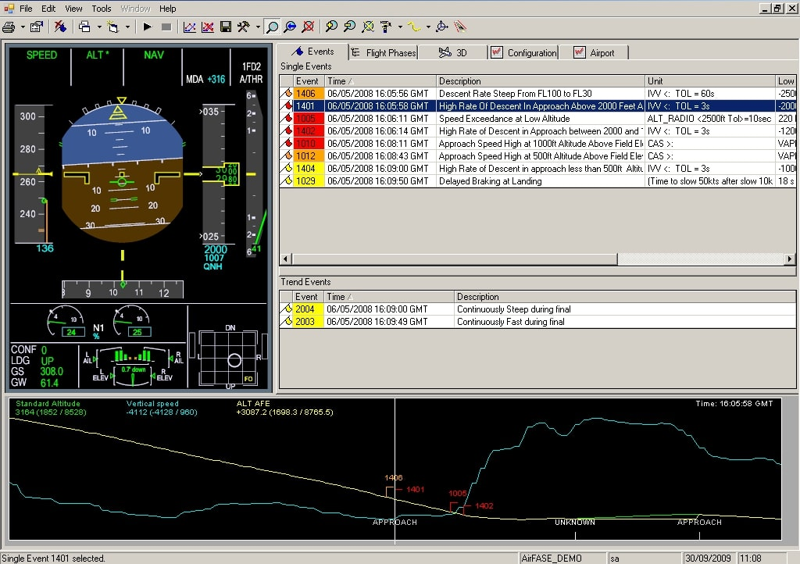
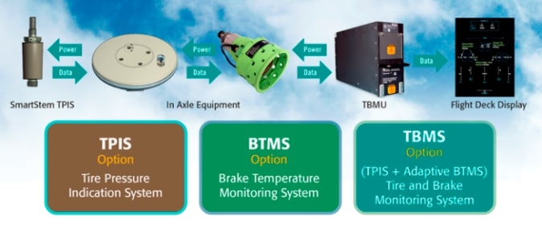

# Data Science Portfolio
---
## Machine learning

### Fraud Detection

Fraud detection is a set of processes and analyses that allow businesses to identify and prevent unauthorized financial activity. This can include fraudulent credit card transactions, identify theft, cyber hacking, insurance scams, and more.

---
### Landing Gear Controller

Rustom-II is Medium Altitude Long endurance unmanned Aerial Vehicle.
Rustom-II UAV having functionality of under carriage retractable tricycle landing gear With steerable nose and it consists of Nose Gear and Main LandingGears.
Landing Gear Controller is connected to RFCC through MIL 1553B interface.
RFCC is acts as Bus Controller and LGC is acts as Remote Terminal.
Activate the Landing Gear subsystem using assembly like Hydraulic Power pack is to 
function Deployment valve ,Retraction valve and Brake valve.
Landing Gear Controller is required to control and monitor the Deployment and
Retraction of Landing Gears and Control and Monitor operation of Brake sequence

---
### Aircraft Condition Monitoring System

An Aircraft Condition Monitoring system is a predictive maintenance tool consisting of 
high capacity flight data acquisition unit and the associated sensors that sample, 
monitor and record the information of flight parameters from significant aircraft 
system and components.

It is the process by which one or more parameters of a machine are either 
periodically measured or continuously monitored to identify significant changes that 
usually are indicative of a failure in progress. This allows the operator to plan 
maintenance action focused on avoiding failures.

---
### Brake Control Monitoring System for COMAC919

C919 Commercial Airplane for this Crane will assist in the Integration of the Brake 
Control System which include Smartstem passive, Wireless tire pressure sensing 
technology and Brake Temperature Monitoring System.

Brake Controllers receive inputs from sensors which monitor parameters such as 
position,speed,torque,lockup and slip status.

The Brake Control and Monitoring System(BCMS) contain all the necessary Brake 
Control,Autobrake,Antiskid,Tire Pressure Indication, Brake Temperature Monitoring 
and Built-In Test(BIT) functionality for the Main Landing Gear(MLG) wheels and Nose 
Landing Gear(NLG) wheels.

---